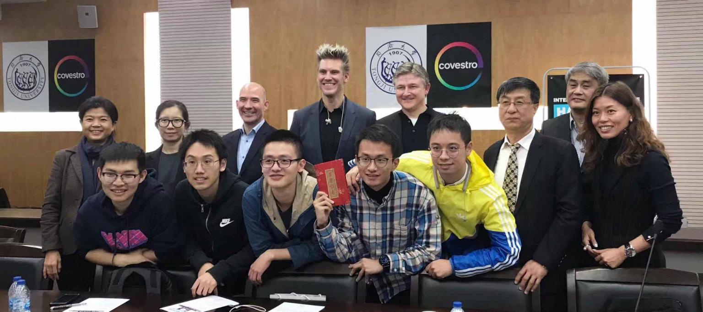

# ParticleFormationChampionSolution-TJ

We are team#6 from Tongji University who won the [**champion** position](https://www.linkedin.com/feed/update/urn:li:activity:6599863028911575040/) in *the International Data Science Hackathon(Chinese region)* hosted by [Covestro](https://www.covestro.com/en).

We are invited to German🇩🇪 to take part in [the first Chemalytix Conference for Data Science](https://covestro.guest.management/en/events/covestro/120/) to present our work this December(2019). 

> Students of **Carnegie Mellon University** from the US and **RWTH Aachen University** from German also took part in this Hackathon and won the contest in their region. [Leader Boards.](https://i4pto.covestro.com/Hackathon/pages/HackathonHome.aspx)
>
> Looking forward to see the winners from CMU and RWTH Aachen University!

## Pitch

[Link2OurPitch](https://drive.google.com/file/d/1duiWZ9U3uKdyysqqjH6baisxsO3aONPm/view?usp=sharing)

## Main Contributions

- **Algorithm Design and Coding :** *Xin Wen*@[xwen99](https://github.com/xwen99) & *Jiawei Liu*@[ganler](https://github.com/ganler)
- **Presentation :** *Renfeng Peng*
- **Video :** *Haoran Zhang*
- **PPT and Group Leader :** *Jiawei Liu*@[ganler](https://github.com/ganler)

> For more informations, please see our codes in `./code/` and our PPT in `./PPT#6.pptx`.
>
> *A big thank to people who are using technologies to make a better world.*

## News

-  [We won the **champion** position!](https://www.linkedin.com/feed/update/urn:li:activity:6599863028911575040/) 